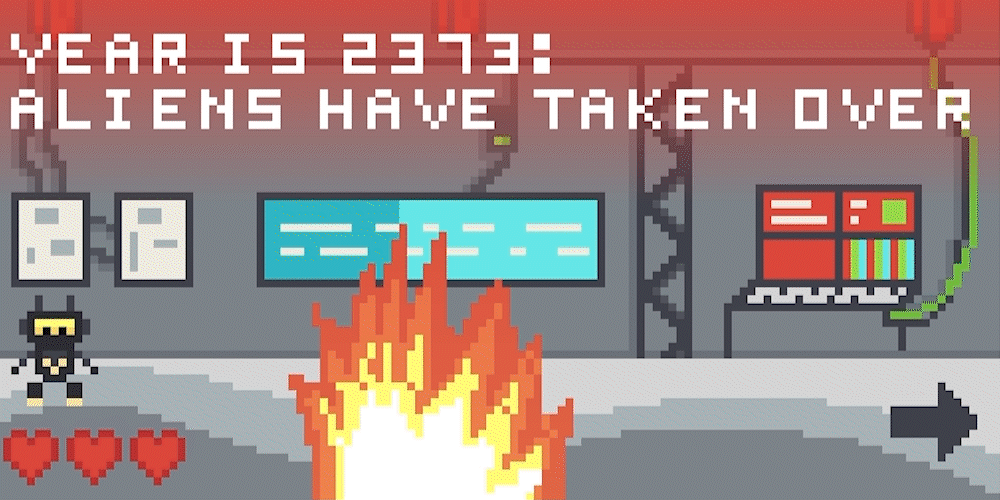

# Planet SCB58 Invasion
A complex MIPS-32 assembly code game where you are a robot defending earth from aliens.

## Design
This game was made only using 32-bit MIPS assembly operations along with a few simple system calls to play sounds and get the system clock. 

As for the architecture of the program, the player has a 'struct' that keeps track of variables like position, power-ups, animation state, and power-ups. Each level has a similar data structure to hold its' state variables, but also has an address that points to its collision data. The collision data defines surfaces and objects that the player can collide with.

Other notable features include the relatively complex rendering system, where a render buffer is used to keep track of the drawn pixels each frame, and which pixels should be deleted this frame. This helps the game achieve really high framerates. Built on top of this rendering system is the text-rendering system, that draws text on top of the level letter-by-letter without slowing down the rendering much.

## Levels Screenshots
<figure>
  
  <figcaption>The first level, where you have to learn the game's movement to jump over the fire that started in the building.</figcaption>
</figure>

<figure>
  
  <figcaption>The boss fight level, where you have to pick up the laser power-up and fight aliens.</figcaption>
</figure>

<figure>
  
  <figcaption>The boss fight, where the aliens shoot tracking projectiles that the player has to dodge while shooting back with the laser power-up.</figcaption>
</figure>

<figure>
  
  <figcaption>The parkour level, where the player has to learn to navigate gravity-reversing beams in order to collect the crystal.</figcaption>
</figure>

## Usage
### Download
Since this is a MIPS-32 assembly program, and the game's rendered frames are memory-mapped, it makes use of the [MARS MIPS Simulator](https://courses.missouristate.edu/kenvollmar/mars/index.htm) which is [included in the repo](MARS/Mars_Updated.jar) or can be downloaded from [Missouri State's website here](https://courses.missouristate.edu/kenvollmar/mars/index.htm).

### MARS Usage
On the toolbar at the top, click 'Tools' and open up the 'Bitmap Display' and 'Keyboard and Display MMIO Simulator' windows.

For the 'Bitmap Display' window, set it up with the following settings:
- Unit Width in Pixels: `8`
- Unit Height in Pixels: `8`
- Display Width in Pixels: `1024`
- Display Height in Pixels: `512`
- Base address for display: `0x10008000 ($gp)`

Then, assemble the program by pressing the assemble button () on the top row of icons, and run the program by clicking the run button (). Then the game should show up on the bitmap display, and can be controlled with WASD controls.

## Controls
- `W` & `Space`:  Jump
- `A`: Move left
- `D`: Move right
- `E`: Laser power-up

Tap each keypress instead of holding down keys for better results.